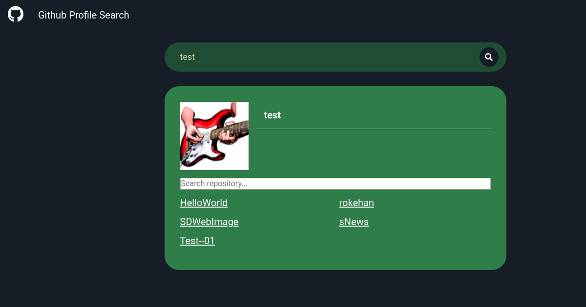

# Notatnik frontendu

## Opis projektu
Wyszukiwarka profili na GitHubie wykorzystująca REST API.
## Technologie
- HTML5
- CSS
- JavaScript
## Metodologie użyte w projekcie
- BEM
- SASS (składnia SCSS)
## Automatyzacja
[WTF gulp starter kit](https://github.com/maciejkorsan/wtf-gulp-starter)

`git clone https://github.com/maciejkorsan/wtf-gulp-starter`
### WTF gulp starter kit
- live server
- kompilacja SASS do CSS
- minifikacja
- dodanie prefiksów
- publikacja strony na github pages
#### Instalacja projektu

`npm install -g gulp-cli`

`npm install`

#### Użycie

`gulp`

Publikacja strony na github pages `npm run deploy`

[Notatnik Frontendu](https://andrzej-jablonski-project.github.io/github-search/)
